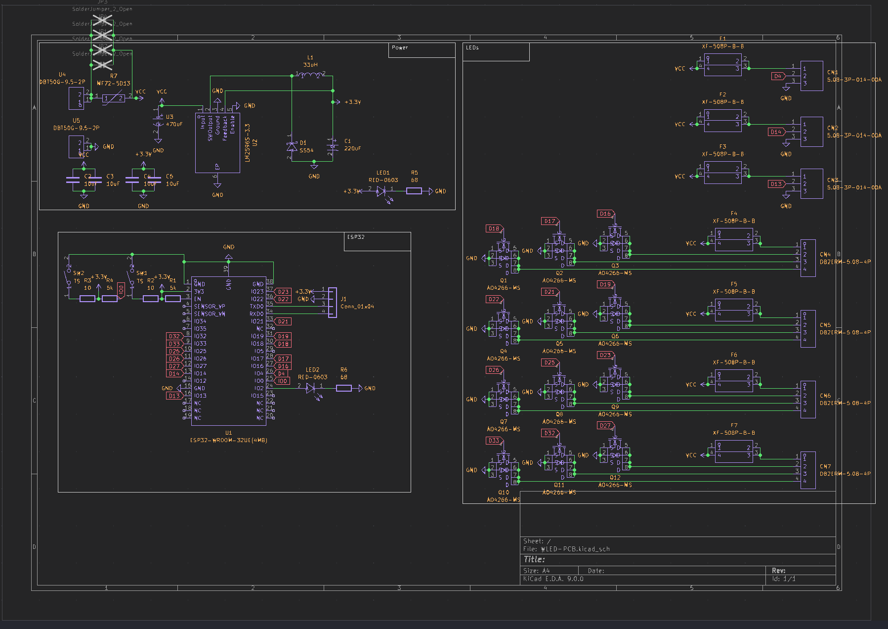
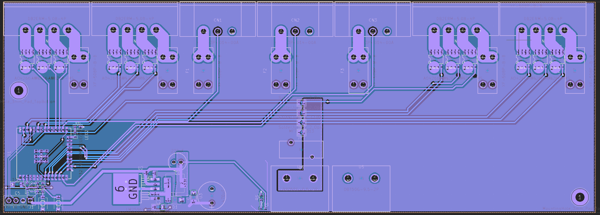
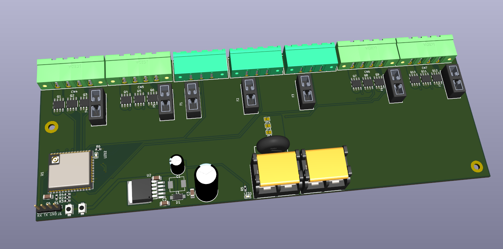

# WLED-PCB

This project is a WLED Controller designed using KiCad. The WLED-PCB is controlled using an ESP32 and can be powered via the Screw Terminals. It is capable of driving multiple RGB Strips and Neopixels. It also has a Fuse Holder per channel to protect the circuit from overcurrent.

## Schematic

## PCB Layout

## 3D View
